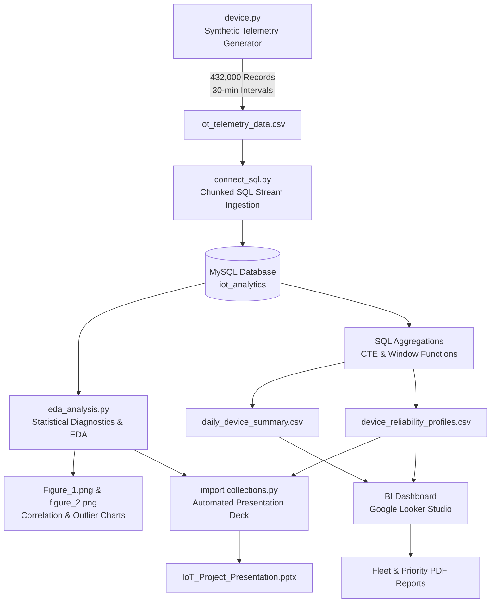

# IoT Hardware Performance & Reliability Analytics

An end-to-end hardware telemetry engineering and statistical reliability analytics pipeline. This project models, ingests, analyzes, and visualizes time-series operational data from a fleet of 50 distributed IoT edge devices to proactively detect component degradation, calculate reliability metrics (MTBF), and prevent catastrophic hardware downtime.

Developed in the **Department of Electronics and Communication Engineering (ECE), Birla Institute of Technology (BIT), Mesra**.

---

## 📌 Table of Contents
- [Executive Overview](#-executive-overview)
- [System Architecture](#-system-architecture)
- [Key Features](#-key-features)
- [Project Structure](#-project-structure)
- [Data Dictionary](#-data-dictionary)
- [Key Engineering & Analytical Insights](#-key-engineering--analytical-insights)
- [Installation & Setup](#-installation--setup)
- [Execution Pipeline](#-execution-pipeline)
- [Outputs & Deliverables](#-outputs--deliverables)
- [Author & Acknowledgments](#-author--acknowledgments)

---

## 🚀 Executive Overview

Managing physical IoT hardware deployments across remote environments poses serious reliability challenges. Manual tracking and reactive maintenance lead to costly, unplanned downtime. This project transitions fleet operations from **reactive troubleshooting** to **proactive predictive reliability**:

- **Fleet Scale:** 50 active IoT edge devices across 5 geographical territories (North, South, East, West, Central).
- **Telemetry Volume:** 432,000 time-series telemetry records spanning 6 months (Jan 1, 2026 – Jun 30, 2026 at 30-minute logging resolution).
- **Component Classes:** Microcontrollers, RF Transceivers, and Power Modules with distinct thermal and electrical operating envelopes.
- **Core Objectives:**
  - Simulate physical hardware behavior, environmental diurnal cycles, and wear degradation.
  - Efficiently ingest high-volume telemetry into a relational MySQL database.
  - Perform statistical exploratory data analysis (EDA), IQR outlier detection, and hypothesis validation.
  - Resolve analytical traps such as **Simpson's Paradox** in pooled telemetry data.
  - Produce operational fleet intelligence, failure prioritization matrices, and executive presentation decks.

---

## 🏗 System Architecture



---

## ⚡ Key Features

### 1. Realistic Telemetry Modeling (`device.py`)
- **Diurnal Environmental Dynamics:** Sinusoidal 24-hour day/night thermal variation models ambient conditions.
- **Hardware-Specific Baseline Physics:**
  - **Power Modules:** Higher operating baseline ($55.0^\circ\text{C}$, $12.0\text{V}$).
  - **Transceivers:** Moderate thermal profile ($40.0^\circ\text{C}$, $3.3\text{V}$), highly sensitive RF signal coherence.
  - **Microcontrollers:** Logic operating baseline ($35.0^\circ\text{C}$, $5.0\text{V}$).
- **Aging & Wear Multipliers:** Simulates progressive physical degradation over time, causing progressive thermal climb and minor voltage droop.
- **Stochastic Fault Injection:** Multi-factor error triggers based on critical temperature limits ($T > T_{\text{base}} + 15\cdot\text{wear}$), severe RF coherence degradation ($< 0.35$), and random component transients.

### 2. Scalable Relational Database Ingestion (`connect_sql.py`)
- **Chunked Streaming:** Ingests large datasets (430k+ rows) into MySQL in batches of 20,000 rows to ensure zero memory exhaustion.
- **Database Optimization:** Structured for indexed timestamp and `device_id` lookups, expanding sort buffers to eliminate query timeouts on heavy analytical aggregations.

### 3. Statistical EDA & Hypothesis Validation (`eda_analysis.py`)
- **Outlier Detection:** Uses the Interquartile Range (IQR) method across segmented hardware types ($1.5 \times \text{IQR}$ threshold) to surface abnormal thermal events.
- **Hypothesis Testing:** Evaluates the degradation relationship between internal device temperature and RF signal coherence:
  - **Pearson Correlation Test:** Rejects the Null Hypothesis with $p < 0.05$, validating a statistically significant negative correlation between operating temperature and communication coherence.
- **Resolving Simpson's Paradox:** Identifies that aggregate/pooled telemetry data produces misleading positive voltage-to-temperature correlations due to differences in component power designs; disaggregating metrics by component type reveals the true physical degradation curves.

### 4. Fleet Reliability & BI Reporting (`import collections.py`)
- **MTBF Calculations:** Derives Mean Time Between Failures across the 50-device fleet, identifying high-risk units (e.g., DEV_034, DEV_045).
- **Automated Executive Presentation:** Scripted generation of a 10-slide widescreen presentation (`IoT_Project_Presentation.pptx`) utilizing `python-pptx`.
- **Fleet Auditing:** Generates summary PDF reports (`fleet report.pdf`, `priority report.pdf`) for operational dispatch and preventative hardware replacement.

---

## 📂 Project Structure

```
├── connect_sql.py                   # MySQL ingestion script using SQLAlchemy & PyMySQL
├── device.py                        # Synthetic telemetry generation engine
├── eda_analysis.py                  # Statistical EDA, IQR outlier detection, & hypothesis testing
├── import collections.py            # Automated PPTX presentation generator
├── daily_device_summary.csv         # Aggregated daily operational metrics per device
├── device_reliability_profiles.csv  # Fleet reliability ranking, lifetime metrics & MTBF
├── Figure_1.png                     # Telemetry correlation heatmap
├── figure_2.png                     # Boxplot of temperature distributions and outliers
├── fleet report.pdf                 # Comprehensive fleet status documentation
├── priority report.pdf              # High-priority maintenance and failure risk report
├── IoT_Project_Presentation.pptx   # Executive presentation slide deck
└── README.md                        # Project documentation
```

---

## 📊 Data Dictionary

### Raw Telemetry (`iot_telemetry_data.csv`)
| Column | Type | Description |
|---|---|---|
| `timestamp` | DATETIME | 30-minute interval logging timestamp (2026-01-01 to 2026-06-30) |
| `device_id` | VARCHAR(10) | Unique device identifier (`DEV_001` through `DEV_050`) |
| `location` | VARCHAR(50) | Geographical deployment zone (North, South, East, West, Central) |
| `component_type` | VARCHAR(50) | Hardware category (`Microcontroller`, `Transceiver`, `Power_Module`) |
| `temperature_celsius` | FLOAT | Core operating temperature in degrees Celsius |
| `operating_voltage` | FLOAT | Measured supply voltage |
| `signal_coherence_index`| FLOAT | RF communication quality index ranging from 0.0 (lost) to 1.0 (ideal) |
| `error_flag` | INT | Binary failure flag (`1` for anomalous threshold breach, `0` for normal) |

### Device Reliability Profile (`device_reliability_profiles.csv`)
| Column | Type | Description |
|---|---|---|
| `device_id` | VARCHAR(10) | Unique device identifier |
| `location` | VARCHAR(50) | Deployment location |
| `component_type` | VARCHAR(50) | Component category |
| `lifetime_avg_temp` | FLOAT | Mean operating temperature across deployment period |
| `lifetime_avg_volt` | FLOAT | Mean supply voltage across deployment period |
| `lifetime_avg_signal` | FLOAT | Mean signal coherence index |
| `lifetime_total_errors` | INT | Cumulative error/fault count |
| `mtbf_hours` | FLOAT | Mean Time Between Failures in operating hours |

---

## 🔬 Key Engineering & Analytical Insights

1. **Thermal Sensitivity:** Power Modules operate near $55^\circ\text{C}$ nominal, reaching critical alert thresholds above $65^\circ\text{C}$. Transceiver RF coherence deteriorates rapidly when temperature spikes, setting a recommended preventative maintenance ceiling at $45^\circ\text{C}$.
2. **Simpson's Paradox in Fleet Telemetry:**
   - When pooling all hardware types, higher voltages mistakenly appear correlated with higher temperatures ($r \approx 0.82$) solely because 12V Power Modules run hotter than 3.3V Transceivers.
   - Segmenting by component type isolates the actual hardware behavior: each component shows voltage degradation and signal loss under persistent elevated temperatures.
3. **Preventative Action Matrix:**
   - Units such as `DEV_034` (MTBF ~ 185 hrs) and `DEV_045` (19 critical errors) were isolated for immediate bench testing and field replacement prior to total shutdown.

---

## 🛠 Installation & Setup

### Prerequisites
- Python 3.9+
- MySQL Server 8.0+

### 1. Clone the Repository
```bash
git clone <your-repository-url>
cd "ece analytics"
```

### 2. Set Up Virtual Environment & Dependencies
```bash
python -m venv venv
# Windows:
.\venv\Scripts\activate
# Linux/macOS:
source venv/bin/activate

pip install pandas numpy matplotlib seaborn scipy sqlalchemy pymysql python-pptx
```

### 3. Configure Database
Create an active database in your local MySQL instance:
```sql
CREATE DATABASE iot_analytics;
```
Update your credentials in `connect_sql.py` and `eda_analysis.py`:
```python
USER = 'root'
PASSWORD = 'your_mysql_password'
HOST = 'localhost'
PORT = '3306'
DATABASE = 'iot_analytics'
```

---

## 🏃 Execution Pipeline

Follow these steps to run the complete data lifecycle:

```bash
# 1. Synthesize 6 months of fleet telemetry (outputs iot_telemetry_data.csv)
python device.py

# 2. Ingest telemetry into MySQL database in chunked streams
python connect_sql.py

# 3. Perform statistical EDA, outlier detection, and hypothesis validation
python eda_analysis.py

# 4. Generate the executive PowerPoint presentation
python "import collections.py"
```

---

## 📈 Outputs & Deliverables

- **Statistical Charts:**
  - `Figure_1.png`: Metric correlation matrix highlighting operational inter-dependencies.
  - `figure_2.png`: Outlier distribution boxplots per component family.
- **Reporting Deliverables:**
  - `IoT_Project_Presentation.pptx`: 10-slide ready-to-present technical overview.
  - `fleet report*.pdf` & `priority report.pdf`: Tabular executive summaries and priority dispatch lists.

---

## 👤 Author & Acknowledgments

- **Author:** Govardhan Dogga ([@govardhan](mailto:govardhan.dogga@gmail.com))
- **Institution:** Department of Electronics and Communication Engineering (ECE), Birla Institute of Technology (BIT), Mesra, Ranchi - 835215.
- **Focus Area:** Hardware Operations Analytics & IoT Fleet Reliability Engineering.
